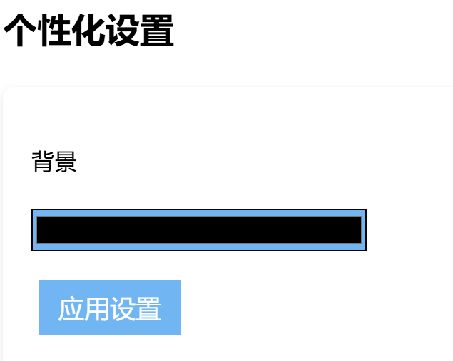

# 个性化

```js
//个性化（终于要开始了吗）
let bgcolor = document.getElementById('bgColor');
function color() {
    let colorInput = document.querySelector("#bgColor"); // 获取背景颜色选择器元素
    let themeColor = colorInput.value;
    // 设置背景颜色
    bgcolor.style.backgroundColor = themeColor; 
    localStorage.setItem('savedBackgroundColor', themeColor); 
}
function loadcolor() {
    let usedcolor = localStorage.getItem('savedBackgroundColor');
    if (usedcolor) {
        bgcolor.style.backgroundColor = usedcolor; // 设置背景颜色
        const elements = document.querySelectorAll('header, button, .session-option'); // 选择多个元素
        elements.forEach(element => {
            element.style.backgroundColor = usedcolor;
        });
    }
}
// 添加事件监听
document.getElementById('applySettings').addEventListener('click', color);
// 页面加载时加载颜色
loadcolor(); 
```