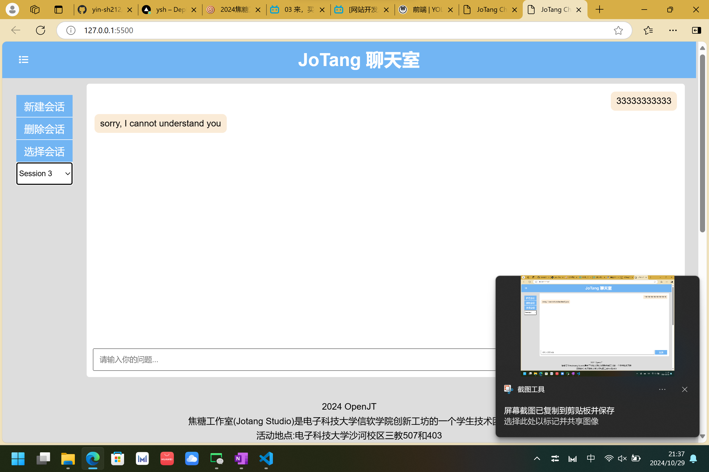

# 切换会话

具体代码分布在（监听，隐藏与显示，存储）
```js
// 监听选择器的变化
sessionSelector.addEventListener('change', function(e) { // target获取的实际是option
    
    for (const message of sessions[currentSessionId]) {
        message.style.display = 'none'
    }
    currentSessionId = e.target.value; // 更新
    for (const message of sessions[currentSessionId]) {
        message.style.display = 'block'
    }
    displayMessages(); 
});
```