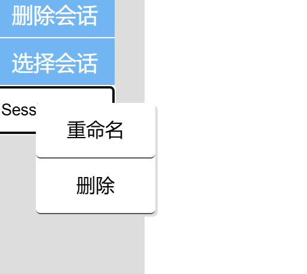

# 右键菜单

```js
// 右键点击会话选择器
    const contextMenu = document.getElementById('contextMenu');
    sessionSelector.addEventListener('contextmenu', (e) => {
        e.preventDefault(); // 阻止默认右键菜单
        const selectedOption = e.target.value; // 获取当前选中的会话
        if (selectedOption) {
        currentSessionId = selectedOption; // 更新当前会话
        contextMenu.style.display = 'block';
        contextMenu.style.left = `${e.pageX}px`;//定位
        contextMenu.style.top = `${e.pageY}px`;
    }
});
```