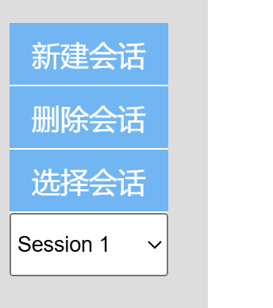

# 新建会话

## 新建选择项
```js
let sessions = {}; // 对象，所有的对话组
let currentSessionId = null; // 记录当前所在会话（大对象的键），字符串
// 新建会话
const newSessionButton = document.getElementById('newSession'); // 获取
newSessionButton.addEventListener('click', function() {
    let sessionId = `Session ${Object.keys(sessions).length + 1}`; // 获得键，是总共有多少组对话
    sessions[sessionId] = []; // 对应键的值是一个空数组//这是一组对话
    currentSessionId = sessionId; // 更新当前键（其实也就是在新建）
    updateSessionSelector();
    displayMessages(); 
});
```
## 新建对话区
发送消息时（确保真的有对话）