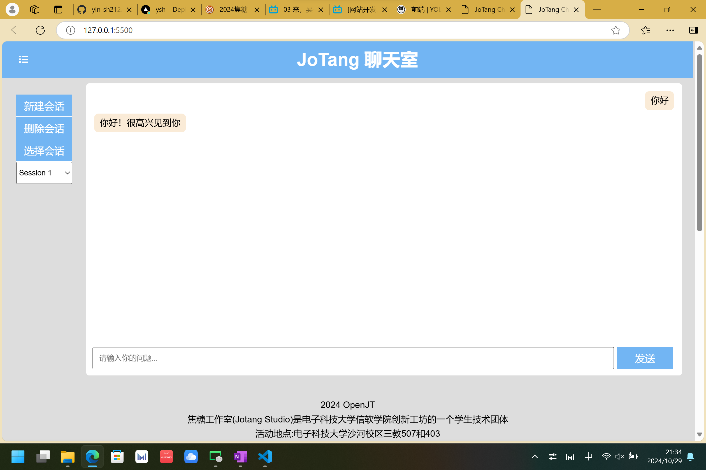

# 简单对话
## 输入&发送

```js
const userInput = document.getElementById('userInput');
const sendButton = document.getElementById('send');
sendButton.addEventListener('click', function() {
    let userMessage = {};//新产生了一个对象
    userMessage.content = userInput.value; 
    userMessage.style = {
        display: 'flex',  
        borderRadius: '8px',
        maxWidth: '80%',
        height: 'auto',
        padding: '4px 10px',
        margin: '3px',
        alignSelf: 'flex-end',
        textAlign: 'right',
        fontSize: '16px',
        wordWrap: 'break-word', 
        backgroundColor: 'antiquewhite',
        color: '#000',
    };
    
    // 记录用户消息
    if (userMessage.content && currentSessionId) {
        sessions[currentSessionId].push(userMessage); // 记录消息//把对象放进数组中
        const userMessageDiv = document.createElement('div'); // a new div
        Object.assign(userMessageDiv.style, userMessage.style);
        userMessageDiv.innerHTML = userMessage.content; 
        const messageContainer = document.getElementById('messages');
        messageContainer.appendChild(userMessageDiv); // 将新的 div 添加到消息容器中
        userInput.value = ''; // 清空输入框
    }
});
```

## 输出
```js
// 回复消息功能
const questions = [
    '你好',
    '你叫什么',
    '今天天气怎么样',
    '今天是星期几？',
    '再见',
    '最近在忙什么呢？'
];
const answers = [
    '你好！很高兴见到你',
    '我是焦糖工作室聊天机器人',
    '我不能提供实时天气信息，但希望你有个好天气！',
    '你可以打开手机上的日历哦，我不知道',
    '再见！期待下次见面',
    '我在学习编程，挺有趣的（）'
];
// 根据用户输入回复消息
function responseMessage(userMessage) {
    let systemMessage = {};//一个对象
    systemMessage.content = 'sorry, I cannot understand you'; // 默认回复内容（一个键值对）
    systemMessage.style = {
        display: 'flex',  
        borderRadius: '8px',
        maxWidth: '80%',
        height: 'auto',
        padding: '4px 10px',
        margin: '3px',
        alignSelf: 'flex-start',
        textAlign: 'left',
        fontSize: '16px',
        wordWrap: 'break-word', 
        backgroundColor: 'antiquewhite',
        color: '#000',
    };
    // 检查用户输入是否在问题列表中
    for (let i = 0; i < questions.length; i++) {
        if (userMessage.content === questions[i]) {
            systemMessage.content = answers[i]; // 设定系统回复
            break;
        }
    }
        sessions[currentSessionId].push(systemMessage); // 记录系统消息
        displayMessages(); // 显示所有消息
}
```

## 显示
```js
// 显示messages
function displayMessages() {
    const messageDiv = document.getElementById('messages'); // 获取
    messageDiv.innerHTML = ''; // 清空
    if (currentSessionId && sessions[currentSessionId]) {
        sessions[currentSessionId].forEach(message => { // 遍历数组
            const messageElement = document.createElement('div'); // 给聊天区加盒子
            messageElement.innerHTML = message.content; // 显示内容
            messageDiv.appendChild(messageElement); // 添加到消息区域
            // messageElement.style.backgroundColor = usedcolor;
            //调用一个函数设置消息的css
            Object.assign(messageElement.style, message.style);
        });
    }
}
```