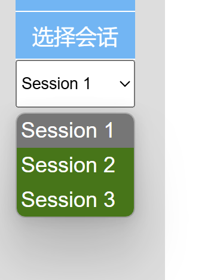

# 选择会话

```js
// 更新会话选择器（为了新建，删除，重命名）
const sessionSelector = document.getElementById('sessionSelector');
function updateSessionSelector() {
    sessionSelector.innerHTML = ''; // 先清空
    for (const session in sessions) // 给每一个键值对一个大盒子//这里是每一次的对话的名字（获取到的是键）
        { 
        const option = document.createElement('option'); // 获取，option是下拉菜单中的一个元素
        option.value = session;
        option.textContent = session; // 填内容
        sessionSelector.appendChild(option); // 加盒子
        option.classList.add('session-option');//设属性
    }
}
// 监听选择器的变化
sessionSelector.addEventListener('change', function(e) { // target获取的实际是option
    
    for (const message of sessions[currentSessionId]) {
        message.style.display = 'none'
    }
    currentSessionId = e.target.value; // 更新
    for (const message of sessions[currentSessionId]) {
        message.style.display = 'block'
    }
    displayMessages(); 
});
```