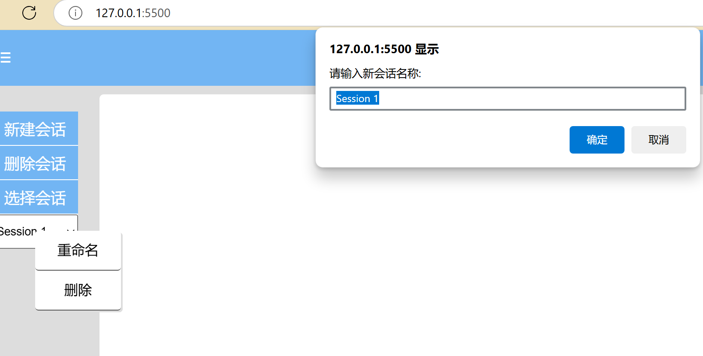

# 重命名

```js
//重命名
const renameSession = document.getElementById('renameSession');
renameSession.addEventListener('click', function(){
    const newName = prompt('请输入新会话名称:', currentSessionId);
    if (newName && !sessions[newName]) { // 确保新名称不为空且没有重复
        sessions[newName] = sessions[currentSessionId]; // 转移消息
        delete sessions[currentSessionId]; // 删除旧会话
        currentSessionId = newName; // 更新当前会话
        updateSessionSelector(); // 更新选择器
        displayMessages(); // 显示消息
    }
    contextMenu.style.display = 'none'; // 隐藏右键菜单
});
```